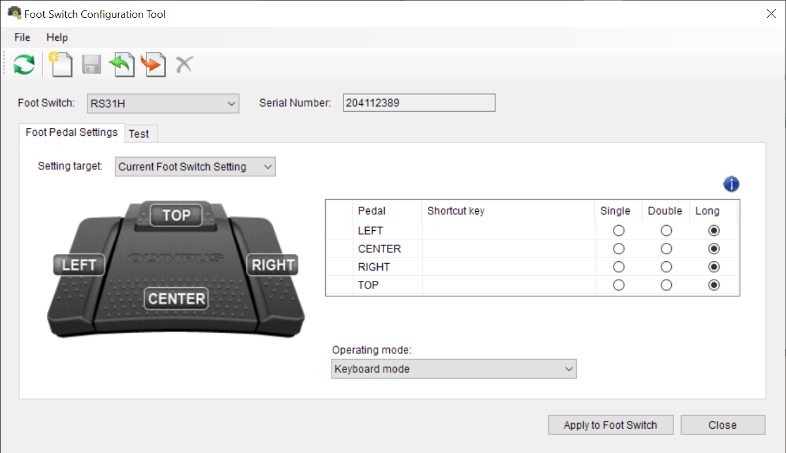

# Foot switch integration

## Hardware

[Olympus RS31H](https://www.amazon.com/Olympus-RS31H-Professional-Dictation-Connection/dp/B01C3FSPQK)

## Installation

Up that link to or link post fort switch configuration tool. Download [Foot Switch Configuration Tool](https://download.omsystem.com/pages/odms_download/ftsw_configuration_tool/en/)

1. Open foot switch configuration tool
1. Change operating mode to: `Keyboard mode`
    - The above step can be achieved by importing [olympus_rs31h.xml](./olympus_rs31h.xml).
        - Download file `olympus_rs31h.xml`
        - Click button `import template`
        - Choose file `olympus_rs31h.xml`
        - Click button `Apply Foot Switch`
1. Change shortcut keys to: F13, F14, F15, F16

    - The above step can be achieved by importing [olympus_rs31h.xml](./olympus_rs31h.xml)
    - On Windows F-keys above F12 won't be visible in the tool, but works if `olympus_rs31h.xml` was imported

        

1. Add [foot_switch.talon](./foot_switch.talon) and [foot_switch.py](./foot_switch.py) to your Talon user directory
1. There might be references to non-community actions for some buttons . Have a look at the Talon log for errors and update [foot_switch.py](./foot_switch.py) with your desired actions.
