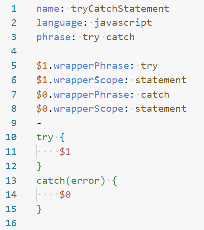
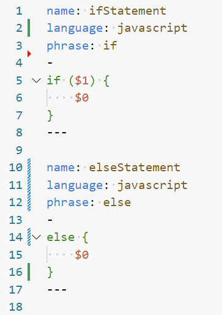
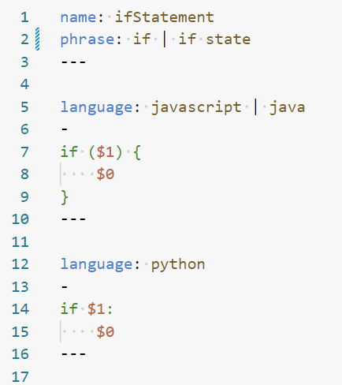

# Snippets

Custom format to represent snippets.

## Features

- Custom file ending `.snippet`.
- Supports syntax highlighting in VSCode via an [extension](https://marketplace.visualstudio.com/items?itemName=AndreasArvidsson.andreas-talon)
- Supports auto-formatting in VSCode via an [extension](https://marketplace.visualstudio.com/items?itemName=AndreasArvidsson.andreas-talon)
- Support for insertion and wrapper snippets. Note that while the snippet file syntax here supports wrapper snippets, you will need to install [Cursorless](https://www.cursorless.org/) for wrapper snippets to work. You'll also need to add the following line to your `settings.talon` file:

  ```talon
  tag(): user.cursorless_use_community_snippets
  ```

  Note that this line will also disable any Cursorless snippets defined in your
  Cursorless customization CSVs. You will need to migrate your Cursorless snippets to the new community snippet format described here. If you'd be interested in a tool to help with this migration, please leave a comment on [cursorless-dev/cursorless#2149](https://github.com/cursorless-dev/cursorless/issues/2149), ideally with a link to your custom snippets for us to look at.

- Support for phrase formatters.

## Format

- A `.snippet` file can contain multiple snippet documents separated by `---`.
- Each snippet document has a context and body separated by `-`.
- Optionally a file can have a single context at the top with no body. This is not a snippet in itself, but default values to be inherited by the other snippet documents in the same file.
- Some context keys supports multiple values. These values are separated by `|`.
  - For most keys like `language` or `phrase` multiple values means _or_. You can use phrase _1_ or phrase _2_. The snippet is active in language _A_ or language _B_.
  - For `insertionFormatter` multiple values means that the formatters will be applied in sequence.

### Context fields

| Key            | Required | Multiple values | Example                        |
| -------------- | -------- | --------------- | ------------------------------ |
| name           | Yes      | No              | `name: ifStatement`            |
| description    | No       | No              | `description: My snippet`      |
| language       | No       | Yes             | `language: javascript \| java` |
| phrase         | No       | Yes             | `phrase: if \| if state`       |
| insertionScope | No       | Yes             | `insertionScope: statement`    |

### Variables

It's also possible to set configuration that applies to a specific tab stop (`$0`) or variable (`$try`):

| Key                | Required | Multiple values | Example                             |
| ------------------ | -------- | --------------- | ----------------------------------- |
| insertionFormatter | No       | Yes             | `$0.insertionFormatter: SNAKE_CASE` |
| wrapperPhrase      | No       | Yes             | `$0.wrapperPhrase: try \| trying`   |
| wrapperScope       | No       | No              | `$0.wrapperScope: statement`        |

## Formatting and syntax highlighting

To get formatting, code completion and syntax highlighting for `.snippet` files: install [andreas-talon](https://marketplace.visualstudio.com/items?itemName=AndreasArvidsson.andreas-talon)

## Examples

### Single snippet definition



### Multiple snippet definitions in single file



### Default context and multiple values


