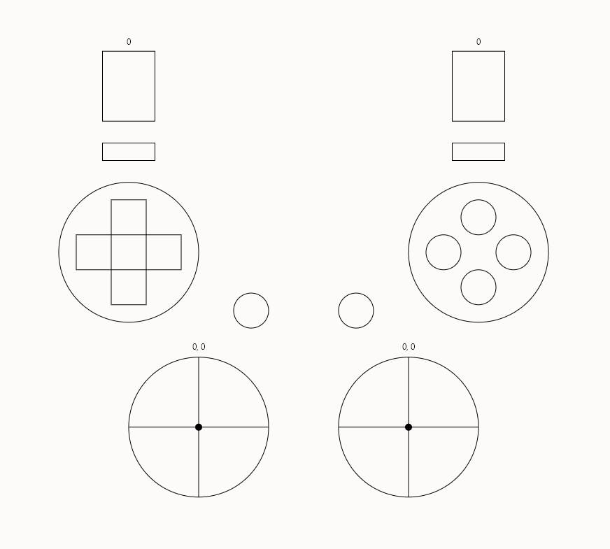

# Gamepad

Some predefined gamepad bindings for doing tasks like clicking, scrolling and moving your cursor.

### Usage

To enable the gamepad bindings activate tag `user.gamepad` in [gamepad_settings.talon](./gamepad_settings.talon)

## Demo - Using gamepad

[YouTube - Gamepad demo](https://youtu.be/zNeiZ9nnK_A)

## Gamepad tester

### Usage

1. Say `"gamepad tester"` to open gamepad tester UI.
1. Press buttons on actual gamepad and see interaction in UI.
1. Close gamepad tester by saying `"gamepad tester"` again.

### Demo - Gamepad tester

[YouTube - Gamepad tester demo](https://youtu.be/FzfIlaHm8_w)

### Conflict with existing gamepad implementations

The gamepad tester doesn't disable your existing gamepad implementations. If you don't want your existing gamepad implementations to trigger during the testing phase you can add `not tag: user.gamepad_tester` at the top of your gamepad Talon files.
