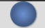
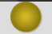
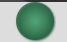
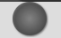
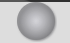

# Mode indicator

Graphical indicator to show you which Talon mode your currently are in. Supports a lot of settings to move, resize and change colors.

## Default colors

Command mode

Dictation mode

Mixed mode

Sleep mode

Other modes

## Usage

You can enable this by changing the following setting in `mode_indicator.talon`:
`user.mode_indicator_show = true`

## Demo

[YouTube - Mode indicator demo](https://youtu.be/1lqtfM4vvH4)
