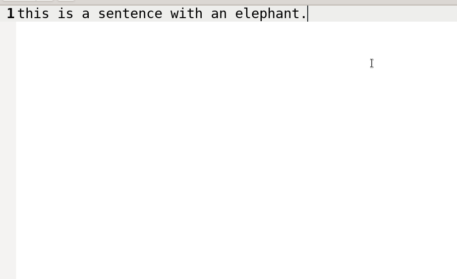

The draft window allows you to more easily edit prose style text via a task-specific UI.

# Usage

The main idea is that we have a Talon controlled text area where each word is labelled with a letter (called an anchor). You can use the anchors to indicate which word you want to operate on.

An session might go like this for example:

    # Start with the text "this is a sentence with an elephant." in your editor or other textbox
    draft edit all            # Select all the text in your editor and moves it to the draft window
    replace gust with error   # Replaces the word corresponding with the red anchor 'g' (gust in community) with the word 'error'
    period                    # Add a full stop
    select each through fine  # Select the words starting at the 'e' anchor and ending at 'f'
    say without               # Insert the word 'without' (community)
    title word air            # Make the word corresponding to the 'a' anchor capitalised
    draft submit              # Type the text in your draft window back into your editor
    # End with the text "This is a sentence without error." in your editor or other textbox

Here's a video of me going through the above commands:

# Customising

If you want to change the display of the window you can do by adding some settings to one of your .talon files. See `settings.talon.example` for more details.

# Running tests

There are unit tests that you can run from the repository root like this (assuming your directory is called talon_draft_window):

    (cd ../ && python -m unittest talon_draft_window.test_draft_ui)

The reason for the weirdness is because we have everything in the same directory and are doing relative imports.
